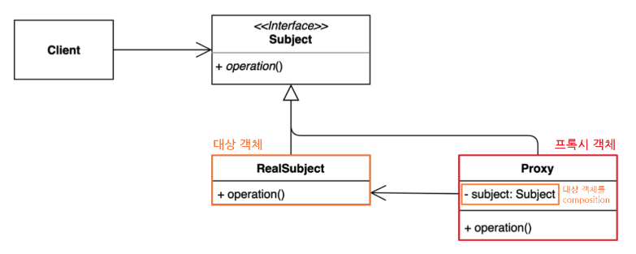
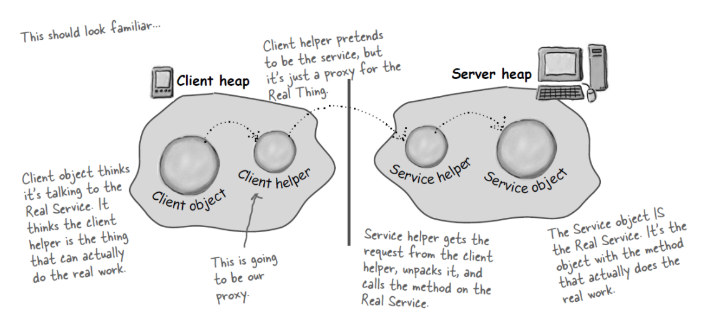

# 프록시 패턴 구조



## 프록시 패턴의 종류

- 기본형 프록시

- 가상 프록시
    - 지연 초기화 방식을 사용해서 메모리상에 항상 올라가있기 어려운 객체들에 대해서 호출 시점에 메모리에 로딩하는 방식을 지원하게 하는 프록시 방식

- 보호 프록시
    - 프록시가 대상 객체에 대한 자원으로서의 엑세스를 제어한다.

- 로깅 프록시
    - 대상 객체에 대한 로깅을 추가하는 경우 사용하는 프록시

- 원격 프록시
    - 프록시 클래스가 로컬에 있고 대상 객체가 원격 서버에 존재하는 경우 사용하는 패턴
    - 프록시(스터브)가 스켈레톤을 호출하고 스켈레톤은 다시 대상 객체를 호출하는 방식으로 원격 프록시가 작동함.



- 캐싱 프록시
    - 대상 객체의 반환값을 캐시로 사용하는 경우 사용하는 패턴
    - ex) HTTP Proxy

## Java Dynamic Proxy

동적으로 프록시 인스턴스를 만들어 등록하는 방법으로 자바의 Reflection API 기법을 응용한 연장선의 개념이다.

```java
interface Animal {
    void eat();
}

class Tiger implements Animal{
    @Override
    public void eat() {
        System.out.println("호랑이가 음식을 먹습니다.");
    }
}
```

```java
public class Client {
    public static void main(String[] arguments) {
        Animal tigerProxy = (Animal) Proxy.newProxyInstance(
            Animal.class.getClassLoader(),
            new Class[]{Animal.class},
            new InvocationHandler() {
                @Override
                public Object invoke(Object proxy, Method method, Object[] args) throws Throwable {
                    Object target =  new Tiger();

                    Object result  method.invoke(target, args);

                    return result;
                }
            }
        )

        tigerProxt.eat();
    }
}
```

## Spring AOP

Spring AOP는 프록시 패턴의 구조 기반으로 Dynamic Proxy와 CGLIB를 사용하여 구현된다.

만약 인터페이스가 있는 객체에 대해서는 Dynamic Proxy를 이용해서 AOP가 작동하게 되고 인터페이스가 없는 객체의 경우 CGLIB를 사용해서 AOP를 수행하게 된다.

## JAVA RMI

자바에서 원격 프록시를 손쉽게 구현할 수 있게 해주는 기술이다. 

**원격 인터페이스**
```java
import java.rmi.Remote;
import java.rmi.RemoteException;

public interface Hello extends Remote {
    String sayHello() throws RemoteException;
}
```

**서버 측 구현**
```java
import java.rmi.server.UnicastRemoteObject;
import java.rmi.Naming;
import java.rmi.RemoteException;

public class HelloImpl extends UnicastRemoteObject implements Hello {
    public HelloImpl() throws RemoteException {
        super();
    }

    public String sayHello() throws RemoteException {
        return "Hello, world!";
    }

    public static void main(String[] args) {
        try {
            HelloImpl obj = new HelloImpl();
            Naming.rebind("HelloServer", obj);
            System.out.println("HelloServer bound in registry");
        } catch (Exception e) {
            System.out.println("HelloImpl err: " + e.getMessage());
            e.printStackTrace();
        }
    }
}
```

**클라이언트 측 구현**
```java
import java.rmi.Naming;

public class HelloClient {
    public static void main(String[] args) {
        try {
            String name = "HelloServer";
            Hello hello = (Hello) Naming.lookup(name);
            System.out.println(hello.sayHello());
        } catch (Exception e) {
            System.out.println("Exception in HelloClient: " + e);
            e.printStackTrace();
        }
    }
}
```